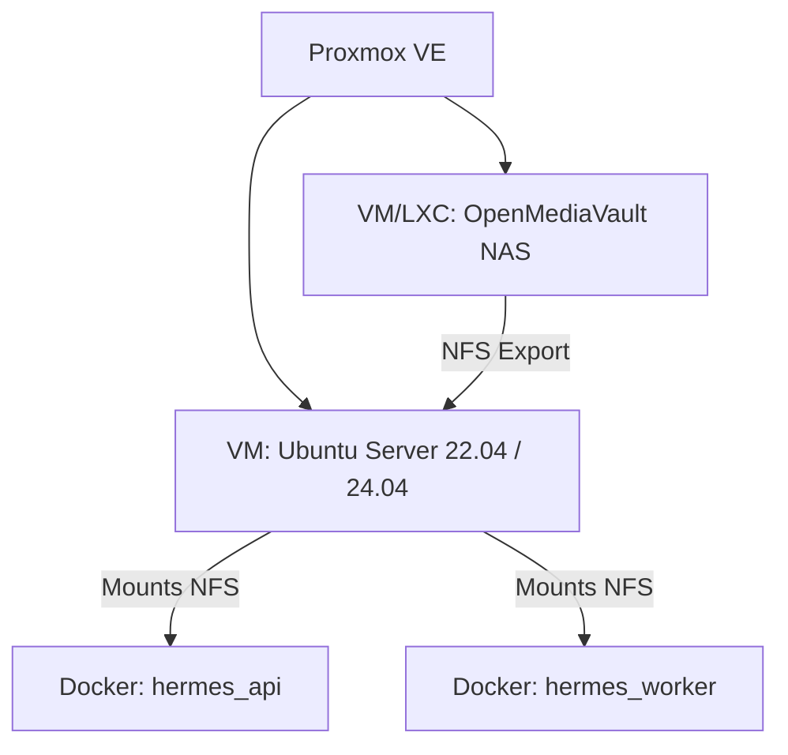

# Panduan Deployment: Hermes YouTube Automation System

Panduan ini menjelaskan langkah demi langkah untuk menginstal dan menjalankan sistem **Hermes** dari awal pada **Ubuntu Server VM** di Proxmox, yang terintegrasi dengan penyimpanan **OpenMediaVault (OMV)** via NFS.

---

## Arsitektur Infrastruktur



---

## Langkah 1: Persiapan di OpenMediaVault (OMV)

Sistem Hermes membutuhkan direktori penyimpanan bersama untuk membaca berkas video mentah, menyimpan thumbnail, melakukan arsip, dan backup database.

### 1. Buat Shared Folder di OMV
Di Dashboard OMV, buat folder bersama dengan struktur berikut di dalam disk penyimpanan Anda:
- `Video_Ready` (Tempat menaruh video musik baru yang siap di-ingest)
- `Archive` (Tempat video dipindahkan secara otomatis setelah sukses di-upload)
- `Backups` (Penyimpanan salinan database harian)
- `Thumbnails` (Penyimpanan aset gambar thumbnail)

### 2. Aktifkan Layanan NFS di OMV
1. Masuk ke **Services** > **NFS** > **Settings** dan aktifkan NFS.
2. Buka tab **Shares**, lalu buat share NFS baru untuk direktori root folder bersama tersebut (misalnya `/srv/dev-disk-by-uuid-.../youtube-agent`).
3. Pada opsi **Client**, masukkan IP dari **Ubuntu Server VM** Anda (misalnya `192.168.1.50`) atau subnet LAN Anda (`192.168.1.0/24`).
4. Atur extra options jika perlu: `subtree_check,insecure,no_root_squash,rw`.

---

## Langkah 2: Persiapan di Ubuntu Server VM

Masuk ke terminal Ubuntu Server VM Anda menggunakan SSH:

### 1. Install NFS Client & Mount Folder OMV
Install package NFS client:
```bash
sudo apt update
sudo apt install -y nfs-common
```

Buat direktori mount lokal:
```bash
sudo mkdir -p /mnt/omv-videos
```

Lakukan mount uji coba (ganti `192.168.1.100` dengan IP OMV Anda dan sesuaikan path share):
```bash
sudo mount -t nfs 192.168.1.100:/export/youtube-agent /mnt/omv-videos
```
*Pastikan Anda bisa menulis berkas di dalam `/mnt/omv-videos`.*

Agar mount berjalan otomatis saat VM melakukan reboot, tambahkan baris berikut di akhir berkas `/etc/fstab`:
```bash
# Buka fstab
sudo nano /etc/fstab

# Tambahkan baris ini di bagian bawah:
192.168.1.100:/export/youtube-agent  /mnt/omv-videos  nfs  defaults,nofail,_netdev  0  0
```

### 2. Install Docker & Docker Compose
Jalankan script instalasi Docker resmi:
```bash
curl -fsSL https://get.docker.com -o get-docker.sh
sudo sh get-docker.sh
```

Tambahkan user Anda ke grup docker agar tidak perlu mengetik `sudo` terus-menerus:
```bash
sudo usermod -aG docker $USER
# Log out dan log in kembali agar perubahan grup aktif
```

---

## Langkah 3: Setup Kode Aplikasi & Environment

### 1. Clone Repositori
Clone kode repositori Hermes ke direktori home Ubuntu Server VM:
```bash
git clone <url_repository_anda> ~/youtube-agent
cd ~/youtube-agent
```

### 2. Buat Berkas Konfigurasi `.env`
Salin template konfigurasi:
```bash
cp .env.example .env
nano .env
```

Sesuaikan nilai-nilai penting berikut:
```env
# Mode Aplikasi
APP_ENV=production

# Database & Redis (Biarkan default jika menggunakan docker-compose)
DATABASE_URL=mysql+aiomysql://hermes_user:hermes_secure_pass@db:3306/hermes_db
REDIS_URL=redis://redis:6379/0

# Kredensial Akun Admin Dashboard
DASHBOARD_USERNAME=admin
DASHBOARD_PASSWORD=ganti_dengan_password_admin_kuat_anda

# Enkripsi Kunci (SANGAT PENTING!)
# Generate kunci enkripsi aman dengan perintah di bawah lalu tempel di sini
HERMES_MASTER_KEY=GANTI_DENGAN_MASTER_KEY_FERNET_ANDA

# API Keys
OPENROUTER_API_KEY=your_openrouter_api_key
DISCORD_WEBHOOK_URL=https://discord.com/api/webhooks/your_webhook_here
```

> [!TIP]
> **Cara generate `HERMES_MASTER_KEY`**:
> Jalankan perintah satu baris ini di terminal Anda untuk membuat kunci enkripsi aman:
> ```bash
> python3 -c "import secrets, base64; print(base64.urlsafe_b64encode(secrets.token_bytes(32)).decode())"
> ```

---

## Langkah 4: Hubungkan ke YouTube API (GCP Console)

Sistem membutuhkan kredensial OAuth 2.0 untuk melakukan upload atas nama channel Anda.

1. Buka [Google Cloud Console](https://console.cloud.google.com/).
2. Buat project baru bernama `hermes-project-01`.
3. Buka **APIs & Services** > **Library**, lalu cari dan aktifkan:
   - **YouTube Data API v3**
   - **YouTube Analytics API** (opsional, untuk Tier 2)
4. Masuk ke **OAuth consent screen**:
   - Pilih User Type: **External**.
   - Isi informasi aplikasi (Hermes).
   - Pada bagian **Scopes**, tambahkan scope: `.../auth/youtube.upload` dan `.../auth/youtube.readonly`.
   - Di bagian **Test users**, **WAJIB** daftarkan alamat email dari channel YouTube yang ingin Anda kelola.
5. Masuk ke **Credentials**:
   - Klik **Create Credentials** > **OAuth client ID**.
   - Application type: **Web application**.
   - Tambahkan **Authorized redirect URIs**:
     - `http://<IP_UBUNTU_VM>:8000/auth/youtube/callback` (misal: `http://192.168.1.50:8000/auth/youtube/callback`)
     - Dan tambahkan `http://localhost:8000/auth/youtube/callback` untuk pengujian lokal.
   - Unduh berkas JSON kredensial tersebut, ubah namanya menjadi `client_secrets.json`, lalu letakkan di direktori utama repositori Anda di VM (`~/youtube-agent/client_secrets.json`).

---

## Langkah 5: Jalankan Aplikasi via Docker Compose

### 1. Build & Jalankan Container
Jalankan semua service (MySQL, Redis, API Dashboard, Celery Worker, Celery Beat) di latar belakang:
```bash
docker compose up -d --build
```

### 2. Jalankan Migrasi Database Pertama Kali
Terapkan semua skema tabel database:
```bash
docker compose exec api env PYTHONPATH=. alembic upgrade head
```

### 3. Periksa Log untuk Memastikan Keadaan Sehat
Pastikan tidak ada error startup di API maupun Worker:
```bash
docker compose logs -f
```

---

## Langkah 6: Penggunaan Pertama Kali

1. Buka browser di komputer Anda yang berada di satu jaringan LAN.
2. Masuk ke alamat: `http://<IP_UBUNTU_VM>:8000/` (misal: `http://192.168.1.50:8000/`).
3. Masuk menggunakan username & password yang Anda definisikan di berkas `.env` tadi.
4. Pergi ke menu **📺 Channels** dan pilih **+ Tambah Channel**.
5. Setelah channel dibuat, klik tombol **🔑 OAuth Setup** untuk menautkan channel tersebut secara aman dengan otorisasi akun Google Anda.
6. Taruh video musik perdana Anda di folder `/mnt/omv-videos/Video_Ready/` (atau folder OMV Anda).
7. Perhatikan **Queue Monitor** di dashboard; berkas video Anda akan terdeteksi, AI akan mulai merancang judul & metadata, dan video akan masuk ke daftar antrean.
