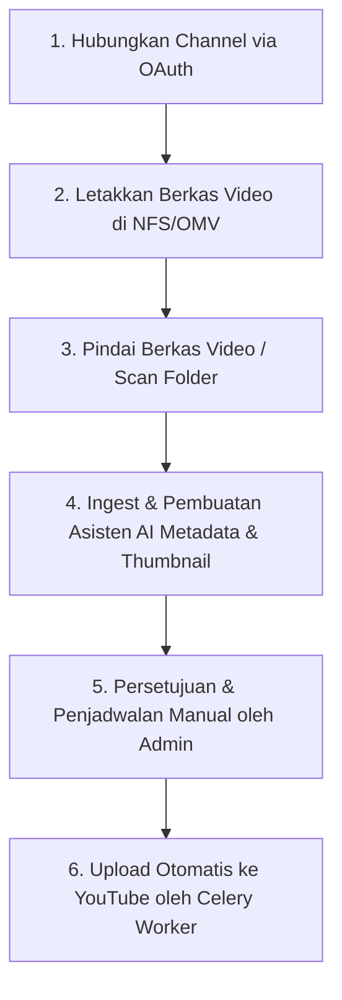

# Hermes YouTube Automation System: Quickstart Guide

Dokumen ini berisi panduan langkah demi langkah untuk pertama kali mencoba dan mengoperasikan sistem otomasi **Hermes** Anda, mulai dari menghubungkan channel hingga mengunggah video menggunakan kecerdasan buatan (AI).

---

## Gambaran Umum Alur Kerja (Workflow)

---

## Langkah 1: Hubungkan Channel YouTube Baru

1. Masuk ke halaman dashboard **Hermes** (`https://ytagent.my.id/`).
2. Masuk ke menu **Channels** di navigasi atas.
3. Klik tombol **+ Tambah Channel**:
   * Isi nama channel (sebagai identitas awal, nama asli akan disinkronkan otomatis dari YouTube setelah login).
   * Pilih **Genre** (misalnya: *Music*, *Education*, dll).
   * Isi **Path Scanner**: Ini adalah nama subfolder khusus di dalam penyimpanan NFS/OMV Anda (contoh: `tokyo_lofi`). Jika dikosongkan, ia akan menggunakan nama otomatis berbasis draft.
4. Setelah channel tersimpan di tabel sebagai status *Draft*, klik tombol **🔑 OAuth Setup** pada channel bersangkutan.
5. Anda akan dialihkan ke halaman Google Account:
   * Pilih akun Google yang memiliki channel YouTube tersebut.
   * Klik **Lanjutkan / Allow** untuk memberikan izin pengelolaan YouTube ke aplikasi Hermes.
   * Setelah sukses, Anda akan dialihkan kembali ke Hermes, status berubah menjadi **AKTIF** dan **OAuth: VALID**.

---

## Langkah 2: Mempersiapkan Folder Scanner di NFS (OMV)

Sistem memindai file video secara otomatis berdasarkan nama subfolder yang Anda tentukan di **Path Scanner**.

1. Masuk ke server penyimpanan NFS (OpenMediaVault) Anda.
2. Di bawah direktori utama `Video_Ready`, buat folder baru dengan nama yang sama persis seperti yang Anda atur di **Path Scanner** channel Anda.
   * *Contoh*: Jika Path Scanner diatur ke `tokyo_lofi`, maka struktur foldernya di server adalah:
     `/mnt/omv-videos/Video_Ready/tokyo_lofi/`
3. Masukkan satu atau beberapa video musik mentah (format `.mp4` atau `.mkv`) ke dalam folder `tokyo_lofi/` tersebut.

---

## Langkah 3: Memulai Pemindaian File (Scanning)

Secara default, **Celery Beat** berjalan otomatis untuk memindai folder NFS setiap **1 jam sekali**. Namun, Anda bisa memicunya langsung tanpa menunggu:

1. Di dashboard Hermes, masuk ke menu **Channels** lalu pilih channel Anda.
2. Di sebelah isian Path Scanner, klik tombol **⚡ Trigger Scan** (atau ikon Scan).
3. Sistem akan memindai folder `/mnt/omv-videos/Video_Ready/tokyo_lofi/` secara real-time.
4. Jika file video terdeteksi, status video tersebut akan masuk ke dalam **Queue Monitor** (Antrean) dengan status awal **`PENDING`**.

---

## Langkah 4: Pembuatan Judul, Deskripsi & Thumbnail via AI

Setelah video masuk ke status `PENDING`, sistem asinkron (Celery Worker) akan memprosesnya otomatis:

1. **Pembuatan Metadata oleh AI (Status: `METADATA_READY`)**:
   * AI akan menganalisis nama file video, genre channel, dan pola yang ada untuk merancang **Judul Video**, **Deskripsi Lengkap**, **Tags**, serta **Kategori YouTube** yang optimal.
2. **Pembuatan Gambar Thumbnail (Status: `AWAITING_APPROVAL`)**:
   * Worker akan mengambil cuplikan frame dari video mentah Anda, lalu menggabungkannya secara otomatis dengan template gambar yang telah disiapkan di folder `/mnt/omv-thumbnails/templates/<genre>.png`.
3. Setelah kedua proses di atas selesai, video akan mendarat di status **`AWAITING_APPROVAL`** (Menunggu Persetujuan).

---

## Langkah 5: Review & Penjadwalan (Approval)

Sebagai admin, Anda memegang kendali penuh sebelum video terbit ke publik.

1. Buka menu **Queue Monitor** di dashboard.
2. Klik tombol **Review** pada video yang berstatus `AWAITING_APPROVAL`.
3. Di halaman detail review:
   * **Periksa Metadata**: Anda bisa mengedit Judul, Deskripsi, dan Tags yang dihasilkan AI jika ingin disempurnakan.
   * **Periksa Thumbnail**: Anda dapat melihat preview gambar thumbnail yang telah digabungkan secara otomatis.
   * **Atur Tanggal Publish**: Pilih tanggal dan jam kapan video ini harus terunggah secara otomatis ke YouTube.
4. Klik tombol **Setujui & Jadwalkan (Approve & Schedule)**.
5. Status video akan berubah menjadi **`SCHEDULED`**.

---

## Langkah 6: Upload Otomatis ke YouTube

1. Celery Beat mendeteksi video-video berstatus `SCHEDULED` setiap 2 menit sekali.
2. Jika waktu penjadwalan telah tiba (atau lewat), Celery Worker akan mengambil file video tersebut dan mengunggahnya langsung ke server YouTube menggunakan credential OAuth 2.0 milik channel Anda.
3. Selama proses upload, status berubah menjadi **`UPLOADING`**.
4. Setelah selesai, status berubah menjadi **`DONE`** (Berhasil Terbit). Anda akan mendapatkan link video YouTube yang aktif, dan file video mentah di server NFS Anda akan dipindahkan secara otomatis ke folder `Archive/` agar penyimpanan tidak penuh.

---

> [!TIP]
> **Di mana saya bisa memantau jika ada error?**
> * **Logs Dashboard**: Anda bisa melihat log aktivitas ringkas (audit logs) langsung pada Widget **Recent Activity Logs** di halaman utama Dashboard Hermes.
> * **Docker Logs**: Untuk detail teknis proses latar belakang, gunakan perintah:
>   `docker compose logs celery_worker -f` atau `docker compose logs api -f`.
